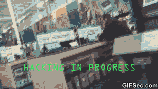

# What is it?


**Computer Science** is the science of Computers ofcourse <span class="smallertx">(heheheh)</span>.Studying Computer science does not nessecarity means you'll only be a Programmer **OR** stick to one specialization path.
It depends on what you enjoy doing and what your job is, you could be doing one thing at work but you build all kind of different stuff in your freetime. Like mobile apps, websites(like this one), [arduino projects](https://create.arduino.cc/projecthub), and much more.
Theres alot more to CS than most people understand. What this guide is for is to `"plant a seed in your mind"` to understand what's possible out there in your future with Computer Science.

::: tip TIP

The ability  be **Self Taught** would be the [most important skill](https://insights.stackoverflow.com/survey/2018/#developer-profile-_-other-types-of-education) to have, not only in CS but any career path you might want to take. There are so much schools and uni could teach you, but to be good in what you are doing. **Teach yourself**
:::

## Specializations

### Web

**Job Titles**: Web Developer(Full-stack, front-end, back-end)

Basiclly, you do everything regarding the web. Thats it.

- **Front-end** web developer build what the website looks like, sometimes also are responsible for the design.

::: tip TRY THIS
Start up your browser, go on any website,

- press `Ctrl+Shift+i`
- or *Right click* select `Inspect Element`

Thats **html**, the code your browser reads and draw up what the site looks like
:::

- **Back-end** web developer develops the functions of the website. Examples:
  - Infinite scrolling (Facebook,Twitter, Reddit)
  - How Each different user see different content when logged in (also Facebook, Twitter, Reddit)
  - Resgistration form, Login, Logout, Session timeout, cookies...
- **Full-Stack** web developer do <u>everything</u>

### Software

**Job Titles**: Software Engineer/Developer, Mobile App Engineer/Developer, Game Developer ,QA Tester,...

Generally this area includes any position that involves programming.
Take 5 minute and think about it, software is present in every aspect of your life.
Its in your smartphones, computers, the apps in your phone/pc.
With the popularity of *smart devices*, software are also present in your watches, TV, fridges, washing machines, toaster, even a [Salt Shaker](https://www.indiegogo.com/projects/smalt-the-world-s-first-interactive-centerpiece#/).

```csharp
// basic c# Hello World Program
pubic static void Main( string[] args){
    Console.WriteLine("Hello World");
}
```

The Responsibilities of a Software Developer often includes:

- Planning the architecture of the project( unless its your own project, this is generally reserved for more experienced/senior developers).
- Building the project according to the plan.
- Testing and fixing bugs (errors)

### Hardware

**Job Titles**: generally belong to the Electrical Engineering field

Typically this would be more interesting to you if you perfer to build physical objects rather than just code.
You'll learn how a circuit board works and get to build some of your own. This can lead to jobs developing computer parts, smart devices(Internet of Things) and such..

Last year I did a summer course in IoT and built [this](https://debubz.github.io/summer/sprint4.html#battery)

### Interaction Desgin

This path focuses more on the designing what your software looks like and how will the user interact with it. For example, where is a certain button located on the screen, what color,... Have a look at the apps on your phone, each characteristics of the app is meticulously design to suit a specific purpose.

### Security



Or something more "legal" such as a Pen Tester, Security Analyst..

If Software is in everything, it can be *hacked*. To protect yourself, your product and your users. Security experts are constantly required to prevent breaches towards your system.

One of the great things about CS careers is you're not just stuck to only working for a company for the rest of your life. Be a freelancer, work for yourself. In the case of **Security** you can do **bug bounties** as a **Peneltration Tester**. This means "ethically" hacking a software/system/website and report it to their company to recieve a monetary reward in return.

### Data

**Job Titles**: Databases administrator

Everything is about data today, the Db Admin's role is to design, create, maintain databases. This includes writing scripts to generate generate reports/ query specific information to be used elsewhere. A good solid, understanding of database is super vital for other projects too.

If you want to take a more bussiness centric path, look in to being a **Data Scientist**, or **Quantitative Researcher**.

> <iframe width="560" height="315" src="https://www.youtube.com/embed/Qd2Kh80ZK6k" frameborder="0" allow="encrypted-media;r gyroscope; picture-in-picture" allowfullscreen></iframe>

### Management <span class="smalltx"> (don`t do this) </span>

**Job titles**: Project manager, and other things?

<span class="smallertx"> Really, dont do it. </span>
Joking aside, managers are vital to make sure the development process of a project goes smoothly and according to plan.
Management are also responsible to remove any obstacles for developers to do their job.
This may include making many difficult choices to satisfy the needs of the *project owner*, the development team and any other teams involved in the project.

::: warning
There are some other areas I have not mentioned (**Machine Learning**, **Artificial Intelligence**, **Networking**...) as I am not familiar with, and are not interested in them. It is important for you to do your own [research](https://www.google.com.au/) and figgure out what interest you.
:::

<style>

.smalltx { font-size:small; }
.smallertx { font-size:x-small; }

</style>
